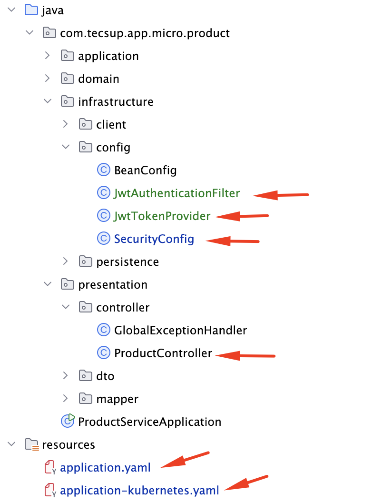

#  Microservicio User-Service - OAuth 2.0 y JWT en Kubernetes



## 1.- Modificar aplicación para agregar JWT


```xml
.
.
.
    <properties>
        <java.version>21</java.version>
        <mapstruct.version>1.5.5.Final</mapstruct.version>
        <jjwt.version>0.12.6</jjwt.version>
    </properties>
.
.
        <!-- ============================================ -->
        <!-- NUEVO - Módulo 4 Session 2: JWT (JJWT)       -->
        <!-- ============================================ -->
        <dependency>
            <groupId>io.jsonwebtoken</groupId>
            <artifactId>jjwt-api</artifactId>
            <version>${jjwt.version}</version>
        </dependency>
        <dependency>
            <groupId>io.jsonwebtoken</groupId>
            <artifactId>jjwt-impl</artifactId>
            <version>${jjwt.version}</version>
            <scope>runtime</scope>
        </dependency>
        <dependency>
            <groupId>io.jsonwebtoken</groupId>
            <artifactId>jjwt-jackson</artifactId>
            <version>${jjwt.version}</version>
            <scope>runtime</scope>
        </dependency>

```
### 1.2.- Creación de clases


#### 1.2.1. Generación y validación de JWT

- JwtTokenProvider.java 

**NOTA:** product-service NO genera tokens. Solo los valida. Misma clave secreta que user-service.

```java
package com.tecsup.app.micro.product.infrastructure.config;

import io.jsonwebtoken.*;
import io.jsonwebtoken.security.Keys;
import lombok.extern.slf4j.Slf4j;
import org.springframework.beans.factory.annotation.Value;
import org.springframework.stereotype.Component;

import javax.crypto.SecretKey;
import java.nio.charset.StandardCharsets;
import java.util.List;

/**
 * Proveedor de tokens JWT para product-service
 *
 * Paquete: com.tecsup.app.micro.product.infrastructure.config
 * Sesión 2 - Módulo 4: OAuth 2.0 y JWT
 *
 * IMPORTANTE: product-service NO genera tokens.
 * Solo valida los tokens generados por user-service.
 * Ambos servicios comparten el mismo JWT_SECRET.
 */
@Component
@Slf4j
public class JwtTokenProvider {

    @Value("${jwt.secret}")
    private String jwtSecret;

    /**
     * Extrae el email (subject) del token
     */
    public String getEmailFromToken(String token) {
        return getClaims(token).getSubject();
    }

    /**
     * Extrae los roles del token
     */
    @SuppressWarnings("unchecked")
    public List<String> getRolesFromToken(String token) {
        Claims claims = getClaims(token);
        return claims.get("roles", List.class);
    }

    /**
     * Valida que el token sea válido
     */
    public boolean validateToken(String token) {
        try {
            getClaims(token);
            return true;
        } catch (ExpiredJwtException e) {
            log.warn("Token JWT expirado: {}", e.getMessage());
        } catch (MalformedJwtException e) {
            log.warn("Token JWT malformado: {}", e.getMessage());
        } catch (JwtException e) {
            log.warn("Token JWT inválido: {}", e.getMessage());
        }
        return false;
    }

    private Claims getClaims(String token) {
        return Jwts.parser()
                .verifyWith(getSigningKey())
                .build()
                .parseSignedClaims(token)
                .getPayload();
    }

    private SecretKey getSigningKey() {
        return Keys.hmacShaKeyFor(jwtSecret.getBytes(StandardCharsets.UTF_8));
    }
}
```

#### 1.2.2. Filtros JWT

- JwtAuthenticationFilter.java

**DIFERENCIA CLAVE:** Obtiene roles directamente del JWT (sin consultar BD). product-service no tiene tabla de usuarios.

```java
package com.tecsup.app.micro.product.infrastructure.config;

import jakarta.servlet.FilterChain;
import jakarta.servlet.ServletException;
import jakarta.servlet.http.HttpServletRequest;
import jakarta.servlet.http.HttpServletResponse;
import lombok.RequiredArgsConstructor;
import lombok.extern.slf4j.Slf4j;
import org.springframework.security.authentication.UsernamePasswordAuthenticationToken;
import org.springframework.security.core.authority.SimpleGrantedAuthority;
import org.springframework.security.core.context.SecurityContextHolder;
import org.springframework.security.web.authentication.WebAuthenticationDetailsSource;
import org.springframework.stereotype.Component;
import org.springframework.util.StringUtils;
import org.springframework.web.filter.OncePerRequestFilter;

import java.io.IOException;
import java.util.List;
import java.util.stream.Collectors;

/**
 * Filtro JWT para product-service
 *
 * Paquete: com.tecsup.app.micro.product.infrastructure.config
 * Sesión 2 - Módulo 4: OAuth 2.0 y JWT
 *
 * DIFERENCIA con user-service:
 *   - user-service: carga el usuario desde BD (CustomUserDetailsService)
 *   - product-service: lee los roles DIRECTAMENTE del JWT (no tiene BD de usuarios)
 *
 * Flujo:
 *   1. Extrae token del header Authorization: Bearer <token>
 *   2. Valida el token con JwtTokenProvider (misma clave secreta)
 *   3. Extrae email y roles del JWT
 *   4. Crea la autenticación sin consultar BD
 */
@Component
@RequiredArgsConstructor
@Slf4j
public class JwtAuthenticationFilter extends OncePerRequestFilter {

    private final JwtTokenProvider jwtTokenProvider;

    @Override
    protected void doFilterInternal(HttpServletRequest request,
                                    HttpServletResponse response,
                                    FilterChain filterChain) throws ServletException, IOException {

        String token = extractTokenFromRequest(request);

        if (StringUtils.hasText(token) && jwtTokenProvider.validateToken(token)) {
            String email = jwtTokenProvider.getEmailFromToken(token);
            List<String> roles = jwtTokenProvider.getRolesFromToken(token);

            log.debug("JWT válido para: {} con roles: {}", email, roles);

            // Crear authorities desde los roles del JWT (sin consultar BD)
            List<SimpleGrantedAuthority> authorities = roles.stream()
                    .map(SimpleGrantedAuthority::new)
                    .collect(Collectors.toList());

            UsernamePasswordAuthenticationToken authentication =
                    new UsernamePasswordAuthenticationToken(email, null, authorities);

            authentication.setDetails(new WebAuthenticationDetailsSource().buildDetails(request));
            SecurityContextHolder.getContext().setAuthentication(authentication);
        }

        filterChain.doFilter(request, response);
    }

    private String extractTokenFromRequest(HttpServletRequest request) {
        String bearerToken = request.getHeader("Authorization");
        if (StringUtils.hasText(bearerToken) && bearerToken.startsWith("Bearer ")) {
            return bearerToken.substring(7);
        }
        return null;
    }
}


```

#### 1.2.4. Activar JWT en SecurityConfig

- SecurityConfig.java
```java
package com.tecsup.app.micro.product.infrastructure.config;

import lombok.RequiredArgsConstructor;
import org.springframework.context.annotation.Bean;
import org.springframework.context.annotation.Configuration;
import org.springframework.http.HttpMethod;
import org.springframework.http.HttpStatus;
import org.springframework.security.config.annotation.method.configuration.EnableMethodSecurity;
import org.springframework.security.config.annotation.web.builders.HttpSecurity;
import org.springframework.security.config.annotation.web.configuration.EnableWebSecurity;
import org.springframework.security.config.http.SessionCreationPolicy;
import org.springframework.security.web.SecurityFilterChain;
import org.springframework.security.web.authentication.UsernamePasswordAuthenticationFilter;

/**
 * Configuración de Spring Security para product-service
 *
 * Paquete: com.tecsup.app.micro.product.infrastructure.config
 * Sesión 1: Autorización por URL
 * Sesión 2: Validación de JWT (product-service NO genera tokens, solo los valida)
 *
 * Endpoints:
 *   GET  /api/products             → público
 *   GET  /api/products/available   → público
 *   GET  /api/products/{id}        → público
 *   GET  /api/products/user/{userId} → autenticado
 *   POST /api/products             → ADMIN
 *   PUT  /api/products/{id}        → ADMIN
 *   DELETE /api/products/{id}      → ADMIN
 *   POST /api/orders               → autenticado (Sesión 3)
 *   GET  /api/products/health      → público
 *   Actuator /actuator/health      → público
 */
@Configuration
@EnableWebSecurity
@EnableMethodSecurity
@RequiredArgsConstructor
public class SecurityConfig {

    // =============================================
    // Descomentar para Sesión 2 (JWT)
    // =============================================
    private final JwtAuthenticationFilter jwtAuthenticationFilter;

    @Bean
    public SecurityFilterChain securityFilterChain(HttpSecurity http) throws Exception {
        http
                .csrf(csrf -> csrf.disable())

                .sessionManagement(session ->
                        session.sessionCreationPolicy(SessionCreationPolicy.STATELESS)
                )

                .authorizeHttpRequests(auth -> auth
                        // Endpoints públicos (lectura de productos)
                        .requestMatchers(HttpMethod.GET, "/api/products").permitAll()
                        .requestMatchers(HttpMethod.GET, "/api/products/available").permitAll()
                        .requestMatchers(HttpMethod.GET, "/api/products/health").permitAll()
                        .requestMatchers(HttpMethod.GET, "/api/products/{id}").permitAll()
                        .requestMatchers("/actuator/health/**").permitAll()

                        // Solo ADMIN puede crear, actualizar, eliminar productos
                        .requestMatchers(HttpMethod.POST, "/api/products").hasRole("ADMIN")
                        .requestMatchers(HttpMethod.PUT, "/api/products/**").hasRole("ADMIN")
                        .requestMatchers(HttpMethod.DELETE, "/api/products/**").hasRole("ADMIN")

                        // Todo lo demás requiere autenticación
                        .anyRequest().authenticated()
                )

                // =============================================
                // Sesión 2: JWT (descomentar)
                // =============================================
                .addFilterBefore(jwtAuthenticationFilter, UsernamePasswordAuthenticationFilter.class)

                // Manejo de errores
                .exceptionHandling(ex -> ex
                        .authenticationEntryPoint((request, response, authException) -> {
                            response.setStatus(HttpStatus.UNAUTHORIZED.value());
                            response.setContentType("application/json");
                            response.getWriter().write("""
                                        {
                                            "error": "No autenticado", 
                                            "status": 401,
                                            "message": "Debes autenticarte para acceder a este recurso"
                                         }
                                    """);
                        })
                        .accessDeniedHandler((request, response, accessDeniedException) -> {
                            response.setStatus(HttpStatus.FORBIDDEN.value());
                            response.setContentType("application/json");
                            response.getWriter().write("""
                                        {
                                            "error": "Acceso denegado", 
                                            "status": 403,
                                            "message": "No tienes permisos para acceder a este recurso"
                                         }
                                    """);
                        })
                );

        return http.build();
    }
}


```

#### 1.2.5. Configuración application.yaml y application-kubernetes.yaml

- application.yaml y application-kubernetes.yaml

Agregar configuración de JWT

```yaml


# ============================================
# JWT CONFIGURATION (Sesión 2)
# ============================================
jwt:
  secret: ${JWT_SECRET:m1S3cr3tK3yJWT_T3csup2025!@#SecureToken}
  expiration: 3600000  # 1 hora en milisegundos


```

### 1.3.- Verificar en localhost

- Ejecutar la aplicación y probar los endpoints con Postman o curl.

```
# 1. Login como ADMIN → obtener JWT
TOKEN=$(curl -s -X POST http://localhost:8081/api/auth/login \
  -H "Content-Type: application/json" \
  -d '{"email":"juan.perez@example.com","password":"admin123"}' \
  | jq -r '.token')

echo $TOKEN

# 2. Acceder con JWT de ADMIN → 200
curl -H "Authorization: Bearer $TOKEN" http://localhost:8081/api/users

# 3. Crear producto con JWT de ADMIN → 201
curl -X POST http://localhost:8082/api/products \
  -H "Authorization: Bearer $TOKEN" \
  -H "Content-Type: application/json" \
  -d '{"name":"Test Product","description":"Test Product Description", "price":99.99,"stock":10, "category":"Electronics","createdBy":1}'

# 4. Login como USER
TOKEN_USER=$(curl -s -X POST http://localhost:8081/api/auth/login \
  -H "Content-Type: application/json" \
  -d '{"email":"maria.garcia@example.com","password":"user123"}' \
  | jq -r '.token')

echo $TOKEN_USER

# 5. Crear producto con USER → 403
curl -X POST http://localhost:8082/api/products \
  -H "Authorization: Bearer $TOKEN_USER" \
  -H "Content-Type: application/json" \
  -d '{"name":"Test Product ","description":"Test Product Description", "price":99.99,"stock":10, "category":"Electronics","createdBy":1}'

#
#     {
#        "error": "Acceso denegado",
#        "status": 403,
#        "message": "No tienes permisos para acceder a este recurso"
#     }
#

# 6. Sin JWT → 401
curl -X POST http://localhost:8082/api/products \
  -H "Content-Type: application/json" \
  -d '{"name":"Test Product ","description":"Test Product Description", "price":99.99,"stock":10, "category":"Electronics","createdBy":1}'
  
#
# {
#     "error": "No autenticado",
#     "status": 401,
#     "message": "Debes autenticarte para acceder a este recurso"
# }
#

```

## 2.- Desplegar en Kubernetes con AUTH2.0 y JWT : TODO


### 2.1.- Construir imagen Docker y probar localmente (ver README.md)

#### Constuir imagen

```
# Compilar el proyecto (si es necesario)
mvn clean package -DskipTests

# Construir imagen
docker build -t product-service:1.0 .

# Verificar imagen creada
docker images | grep product-service

# Deberías ver:
# product-service   1.0   abc123def456   1 minute ago   230MB

```

#### Probar la imagen Docker

```
# Ejecutar contenedor de la app
docker run -p 8082:8082 \
-e SPRING_PROFILES_ACTIVE=kubernetes \
-e DB_URL=jdbc:postgresql://host.docker.internal:5434/productdb \
-e DB_USERNAME=postgres \
-e DB_PASSWORD=postgres \
product-service:1.0

# En otra terminal, probar

# Health check
curl http://localhost:8082/actuator/health

# Respuesta esperada:
# {"status":"UP","groups":["liveness","readiness"]}

# Listar usuarios
curl http://localhost:8082/api/products

# Respuesta esperada
 {
     "error": "No autenticado",
     "status": 401,
     "message": "Debes autenticarte para acceder a este recurso"
 }

# Detener el servicio Ctrl + C
```

### 2.2.- Desplegar en Kubernetes (ver README.md)

- Verificar el contexto de Docker Desktop

```
# Ver contextos
kubectl config get-contexts

# Cambiar el contexto "docker-desktop"
kubectl config use-context docker-desktop

# Verificar el cambio 
kubectl config current-context

```
- Reiniciar el deployment para aplicar los cambios:
```
 kubectl rollout restart deployment product-service -n product-service
```
- Verificar despliegue, servicio y pods:
```
# Verificar despliegue
kubectl get deployments -n product-service

# Verificar servicio
kubectl get service -n product-service

# Verificar pods
kubectl get pods  -n product-service

# Ver detalles de un pod
kubectl describe pod <POD_NAME> -n product-service

# Ver logs en tiempo real
kubectl logs -f <POD_NAME> -n product-service

```


### 2.3.- Probar autenticación en Kubernetes

```

# 1. Login como ADMIN → obtener JWT
TOKEN=$(curl -s -X POST http://localhost:30081/api/auth/login \
  -H "Content-Type: application/json" \
  -d '{"email":"juan.perez@example.com","password":"admin123"}' \
  | jq -r '.token')

echo $TOKEN

# 2. Acceder con JWT de ADMIN → 200
curl -H "Authorization: Bearer $TOKEN" http://localhost:30081/api/users

# 3. Crear producto con JWT de ADMIN → 201
curl -X POST http://localhost:30082/api/products \
  -H "Authorization: Bearer $TOKEN" \
  -H "Content-Type: application/json" \
  -d '{"name":"Test Product","description":"Test Product Description", "price":99.99,"stock":10, "category":"Electronics","createdBy":1}'

# 4. Login como USER
TOKEN_USER=$(curl -s -X POST http://localhost:30081/api/auth/login \
  -H "Content-Type: application/json" \
  -d '{"email":"maria.garcia@example.com","password":"user123"}' \
  | jq -r '.token')

echo $TOKEN_USER

# 5. Crear producto con USER → 403
curl -X POST http://localhost:30082/api/products \
  -H "Authorization: Bearer $TOKEN_USER" \
  -H "Content-Type: application/json" \
  -d '{"name":"Test Product ","description":"Test Product Description", "price":99.99,"stock":10, "category":"Electronics","createdBy":1}'

#
#     {
#        "error": "Acceso denegado",
#        "status": 403,
#        "message": "No tienes permisos para acceder a este recurso"
#     }
#

# 6. Sin JWT → 401
curl -X POST http://localhost:30082/api/products \
  -H "Content-Type: application/json" \
  -d '{"name":"Test Product ","description":"Test Product Description", "price":99.99,"stock":10, "category":"Electronics","createdBy":1}'
  
#
# {
#     "error": "No autenticado",
#     "status": 401,
#     "message": "Debes autenticarte para acceder a este recurso"
# }
#

```
